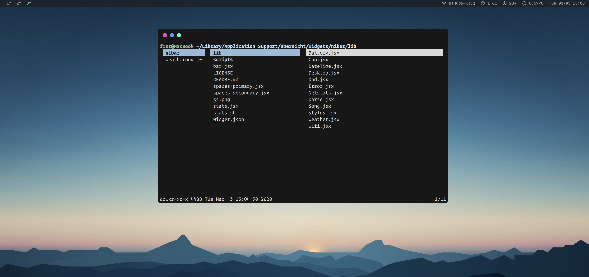

# nibar

Simple [Übersicht](https://github.com/felixhageloh/uebersicht) widget status bar with ↗ [yabai](https://github.com/koekeishiya/yabai) support.

Originally forked from  ↗ [ajdnik/powerbar](https://github.com/ajdnik/powerbar). To ↗ [kkga/nibar](https://github.com/kkga/nibar), made to work with yabai and aesthetically tweaked.
I have added a weather widget that uses the darksky API data, and removed the network stats as I don't care for them.

Planning to tweak the aesthetics to fit my system better.

## Screenshot



## Installation

Clone this repo to your Übersicht widgets directory.

```bash
$ git clone https://github.com/FraserEmbrey/nibar $HOME/Library/Application\ Support/Übersicht/widgets/nibar
```

## Dependencies

- [jq](https://github.com/stedolan/jq) — used for parsing json output and displaying the workspaces widget
    - install with homebrew: `brew install jq`
- [SF Fonts](https://developer.apple.com/fonts/) (optional) — used for symbols in the statusbar widget

## Usage

The widgets for displaying yabai workspaces aren't refreshing automatically.

To refresh them, you can add these lines utilizing [yabai's signals](https://github.com/koekeishiya/yabai/wiki/Commands#automation-with-rules-and-signals) at the end of `.yabairc`:

```sh
# refresh primary display workspaces
yabai -m signal --add event=space_changed \
    action="osascript -e 'tell application \"Übersicht\" to refresh widget id \"nibar-spaces-primary-jsx\"'"

# refresh secondary display workspaces
yabai -m signal --add event=space_changed \
    action="osascript -e 'tell application \"Übersicht\" to refresh widget id \"nibar-spaces-secondary-jsx\"'"
```

## TODO

- [x] add weather widget
- [ ] update weather to work with iTunes, music or spotify
- [ ] update styling to fit system aesthetics
- [ ] add click control for space changes

